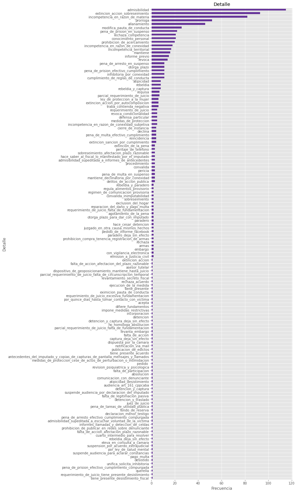

# Imports and general settings


```python
import pandas as pd
import numpy as np
from matplotlib import pyplot as plt
import seaborn as sns
from datetime import datetime
import re
import itertools
import nltk
from nltk.corpus import stopwords
```


```python
plt.style.use('ggplot')
```


```python
df = pd.read_csv('datos.csv')
```


```python
df.loc[df['RELACION_Y_TIPO_ENTRE_ACUSADO/A_Y_DENUNCIANTE'] == 'zona_sur'].replace('zona_sur', np.nan, inplace=True)

# df[df['RELACION_Y_TIPO_ENTRE_ACUSADO/A_Y_DENUNCIANTE'] == 'zona_sur']

```

    /Users/lambda/opt/anaconda3/lib/python3.8/site-packages/pandas/core/frame.py:4166: SettingWithCopyWarning: 
    A value is trying to be set on a copy of a slice from a DataFrame
    
    See the caveats in the documentation: https://pandas.pydata.org/pandas-docs/stable/user_guide/indexing.html#returning-a-view-versus-a-copy
      return super().replace(


# Data Munging


```python
# There are two columns that incorrectly label VIOLENCIA_DE_GENERO as 'no' 
# when positive labels in columns that register types of violence seem to indicate
# that there is in fact violence present.
# We include them in our analysis

# df.loc[[1468, 1500, 2865, 2866], 'VIOLENCIA_DE_GENERO'] = 'si'
```


```python
df = df[df['VIOLENCIA_DE_GENERO'] == 'si'] # Select all the gender violence cases
```


```python
# cast Violence columns into bool type

df['VIOLENCIA_DE_GENERO'] = df['VIOLENCIA_DE_GENERO'].map({'si':True, 'no':False, 's/d':np.nan})
df['VIOLENCIA_DE_GENERO'] = df['VIOLENCIA_DE_GENERO'].astype(bool)

df['V_FISICA'] = df['V_FISICA'].map({'si':True, 'no':False, 's/d':np.nan})
df['V_FISICA'] = df['V_FISICA'].astype(bool)

df['V_PSIC'] = df['V_PSIC'].map({'si':True, 'no':False, 's/d':np.nan})
df['V_PSIC'] = df['V_PSIC'].astype(bool)

df['V_ECON'] = df['V_ECON'].map({'si':True, 'no':False, 's/d':np.nan})
df['V_ECON'] = df['V_ECON'].astype(bool)

df['V_SEX'] = df['V_SEX'].map({'si':True, 'no':False, 's/d':np.nan})
df['V_SEX'] = df['V_SEX'].astype(bool)

df['V_SIMB'] = df['V_SIMB'].map({'si':True, 'no':False, 's/d':np.nan})
df['V_SIMB'] = df['V_SIMB'].astype(bool)

df['V_SOC'] = df['V_SOC'].map({'si':True, 'no':False, 's/d':np.nan})
df['V_SOC'] = df['V_SOC'].astype(bool)

df['V_AMB'] = df['V_AMB'].map({'si':True, 'no':False, 's/d':np.nan})
df['V_AMB'] = df['V_AMB'].astype(bool)

```


```python
violencias = ['V_FISICA', 'V_PSIC', 'V_ECON', 'V_SEX', 'V_SIMB']
df[violencias]
```


<div>
<style scoped>
    .dataframe tbody tr th:only-of-type {
        vertical-align: middle;
    }

    .dataframe tbody tr th {
        vertical-align: top;
    }

    .dataframe thead th {
        text-align: right;
    }
</style>
<table border="1" class="dataframe">
  <thead>
    <tr style="text-align: right;">
      <th></th>
      <th>V_FISICA</th>
      <th>V_PSIC</th>
      <th>V_ECON</th>
      <th>V_SEX</th>
      <th>V_SIMB</th>
    </tr>
  </thead>
  <tbody>
    <tr>
      <th>1</th>
      <td>False</td>
      <td>True</td>
      <td>False</td>
      <td>False</td>
      <td>True</td>
    </tr>
    <tr>
      <th>2</th>
      <td>True</td>
      <td>True</td>
      <td>True</td>
      <td>False</td>
      <td>True</td>
    </tr>
    <tr>
      <th>4</th>
      <td>False</td>
      <td>True</td>
      <td>True</td>
      <td>False</td>
      <td>True</td>
    </tr>
    <tr>
      <th>9</th>
      <td>True</td>
      <td>True</td>
      <td>False</td>
      <td>False</td>
      <td>True</td>
    </tr>
    <tr>
      <th>20</th>
      <td>False</td>
      <td>False</td>
      <td>True</td>
      <td>False</td>
      <td>False</td>
    </tr>
    <tr>
      <th>...</th>
      <td>...</td>
      <td>...</td>
      <td>...</td>
      <td>...</td>
      <td>...</td>
    </tr>
    <tr>
      <th>3618</th>
      <td>True</td>
      <td>True</td>
      <td>True</td>
      <td>True</td>
      <td>True</td>
    </tr>
    <tr>
      <th>3619</th>
      <td>False</td>
      <td>True</td>
      <td>False</td>
      <td>False</td>
      <td>True</td>
    </tr>
    <tr>
      <th>3620</th>
      <td>True</td>
      <td>True</td>
      <td>False</td>
      <td>False</td>
      <td>True</td>
    </tr>
    <tr>
      <th>3624</th>
      <td>False</td>
      <td>True</td>
      <td>False</td>
      <td>False</td>
      <td>True</td>
    </tr>
    <tr>
      <th>3626</th>
      <td>True</td>
      <td>True</td>
      <td>False</td>
      <td>False</td>
      <td>True</td>
    </tr>
  </tbody>
</table>
<p>984 rows × 5 columns</p>
</div>


```python
# Datetime columns

df["FECHA_RESOLUCION"] = pd.to_datetime(df["FECHA_RESOLUCION"], format="%d_%m_%Y", errors="coerce") # casting data to datetime type

```


```python
df["FECHA_DEL_HECHO"] = pd.to_datetime(df["FECHA_DEL_HECHO"], format="%d_%m_%Y", errors="coerce") # casting data to datetime type
```


```python
df = df.set_index(pd.DatetimeIndex(data=df['FECHA_RESOLUCION'], yearfirst=True))
```

# Cleaning


```python
# Column name has a line break at the end which makes it difficult to select

df.columns.values[32] = 'LUGAR_DEL_HECHO'
```


```python
# To do

df[df['ZONA_DEL_HECHO'] == 'mariano acosta 10074']
```


<div>
<style scoped>
    .dataframe tbody tr th:only-of-type {
        vertical-align: middle;
    }

    .dataframe tbody tr th {
        vertical-align: top;
    }

    .dataframe thead th {
        text-align: right;
    }
</style>
<table border="1" class="dataframe">
  <thead>
    <tr style="text-align: right;">
      <th></th>
      <th>N</th>
      <th>NRO_REGISTRO</th>
      <th>FECHA_RESOLUCION</th>
      <th>FIRMA</th>
      <th>MATERIA</th>
      <th>ART_INFRINGIDO</th>
      <th>CODIGO_O_LEY</th>
      <th>CONDUCTA</th>
      <th>CONDUCTA_DESCRIPCION</th>
      <th>VIOLENCIA_DE_GENERO</th>
      <th>...</th>
      <th>LINK_CAMARA.1</th>
      <th>QUEJA_Y_RECURRENTE</th>
      <th>DECISION_DE_ADMISIBILIDAD_TSJ</th>
      <th>N_REGISTRO_Y_TOMO_TSJ</th>
      <th>LINK_TSJ</th>
      <th>DECISION_DE_FONDO_TSJ</th>
      <th>N_REGISTRO_Y_TOMO_TSJ.1</th>
      <th>LINK_TSJ.1</th>
      <th>RECURSO_EXTRAORDINARIO_Y_RECURRENTE</th>
      <th>DECISION_CSJN</th>
    </tr>
    <tr>
      <th>FECHA_RESOLUCION</th>
      <th></th>
      <th></th>
      <th></th>
      <th></th>
      <th></th>
      <th></th>
      <th></th>
      <th></th>
      <th></th>
      <th></th>
      <th></th>
      <th></th>
      <th></th>
      <th></th>
      <th></th>
      <th></th>
      <th></th>
      <th></th>
      <th></th>
      <th></th>
      <th></th>
    </tr>
  </thead>
  <tbody>
    <tr>
      <th>2020-07-15</th>
      <td>2753.0</td>
      <td>2862</td>
      <td>2020-07-15</td>
      <td>Pablo_Casas</td>
      <td>penal</td>
      <td>92</td>
      <td>codigo_penal_de_la_nacion</td>
      <td>lesiones</td>
      <td>agravado</td>
      <td>True</td>
      <td>...</td>
      <td>NaN</td>
      <td>NaN</td>
      <td>NaN</td>
      <td>NaN</td>
      <td>NaN</td>
      <td>NaN</td>
      <td>NaN</td>
      <td>NaN</td>
      <td>NaN</td>
      <td>NaN</td>
    </tr>
  </tbody>
</table>
<p>1 rows × 62 columns</p>
</div>


```python
# To do

df[df['RELACION_Y_TIPO_ENTRE_ACUSADO/A_Y_DENUNCIANTE'] == 'zona_sur']
```


<div>
<style scoped>
    .dataframe tbody tr th:only-of-type {
        vertical-align: middle;
    }

    .dataframe tbody tr th {
        vertical-align: top;
    }

    .dataframe thead th {
        text-align: right;
    }
</style>
<table border="1" class="dataframe">
  <thead>
    <tr style="text-align: right;">
      <th></th>
      <th>N</th>
      <th>NRO_REGISTRO</th>
      <th>FECHA_RESOLUCION</th>
      <th>FIRMA</th>
      <th>MATERIA</th>
      <th>ART_INFRINGIDO</th>
      <th>CODIGO_O_LEY</th>
      <th>CONDUCTA</th>
      <th>CONDUCTA_DESCRIPCION</th>
      <th>VIOLENCIA_DE_GENERO</th>
      <th>...</th>
      <th>LINK_CAMARA.1</th>
      <th>QUEJA_Y_RECURRENTE</th>
      <th>DECISION_DE_ADMISIBILIDAD_TSJ</th>
      <th>N_REGISTRO_Y_TOMO_TSJ</th>
      <th>LINK_TSJ</th>
      <th>DECISION_DE_FONDO_TSJ</th>
      <th>N_REGISTRO_Y_TOMO_TSJ.1</th>
      <th>LINK_TSJ.1</th>
      <th>RECURSO_EXTRAORDINARIO_Y_RECURRENTE</th>
      <th>DECISION_CSJN</th>
    </tr>
    <tr>
      <th>FECHA_RESOLUCION</th>
      <th></th>
      <th></th>
      <th></th>
      <th></th>
      <th></th>
      <th></th>
      <th></th>
      <th></th>
      <th></th>
      <th></th>
      <th></th>
      <th></th>
      <th></th>
      <th></th>
      <th></th>
      <th></th>
      <th></th>
      <th></th>
      <th></th>
      <th></th>
      <th></th>
    </tr>
  </thead>
  <tbody>
    <tr>
      <th>2020-06-24</th>
      <td>2730.0</td>
      <td>2839</td>
      <td>2020-06-24</td>
      <td>Pablo_Casas</td>
      <td>penal</td>
      <td>149bis</td>
      <td>codigo_penal_de_la_nacion</td>
      <td>amenazas</td>
      <td>agravadas_por_uso_de_armas</td>
      <td>True</td>
      <td>...</td>
      <td>NaN</td>
      <td>NaN</td>
      <td>NaN</td>
      <td>NaN</td>
      <td>NaN</td>
      <td>NaN</td>
      <td>NaN</td>
      <td>NaN</td>
      <td>NaN</td>
      <td>NaN</td>
    </tr>
  </tbody>
</table>
<p>1 rows × 62 columns</p>
</div>


# For reference


```python
i = 0
for index, elem in df.dtypes.items():
    print(i, '.', index,'........', elem)
    i += 1
```

    0 . N ........ float64
    1 . NRO_REGISTRO ........ object
    2 . FECHA_RESOLUCION ........ datetime64[ns]
    3 . FIRMA ........ object
    4 . MATERIA ........ object
    5 . ART_INFRINGIDO ........ object
    6 . CODIGO_O_LEY ........ object
    7 . CONDUCTA ........ object
    8 . CONDUCTA_DESCRIPCION ........ object
    9 . VIOLENCIA_DE_GENERO ........ bool
    10 . V_FISICA ........ bool
    11 . V_PSIC ........ bool
    12 . V_ECON ........ bool
    13 . V_SEX ........ bool
    14 . V_SOC ........ bool
    15 . V_AMB ........ bool
    16 . V_SIMB ........ bool
    17 . MODALIDAD_DE_LA_VIOLENCIA ........ object
    18 . FRASES_AGRESION ........ object
    19 . GENERO_ACUSADO/A ........ object
    20 . NACIONALIDAD_ACUSADO/A ........ object
    21 . EDAD_ACUSADO/A AL MOMENTO DEL HECHO ........ object
    22 . NIVEL_INSTRUCCION_ACUSADO/A ........ object
    23 . GENERO_DENUNCIANTE ........ object
    24 . NACIONALIDAD_DENUNCIANTE ........ object
    25 . EDAD_DENUNCIANTE_AL_MOMENTO_DEL_HECHO ........ object
    26 . NIVEL_INSTRUCCION_DENUNCIANTE ........ object
    27 . FRECUENCIA_EPISODIOS ........ object
    28 . RELACION_Y_TIPO_ENTRE_ACUSADO/A_Y_DENUNCIANTE ........ object
    29 . HIJOS/AS_EN_COMUN ........ object
    30 . MEDIDAS_DE_PROTECCION_VIGENTES_AL_MOMENTO_DEL_HECHO ........ object
    31 . ZONA_DEL_HECHO ........ object
    32 . LUGAR_DEL_HECHO ........ object
    33 . FECHA_DEL_HECHO ........ datetime64[ns]
    34 . FECHA_DE_INICIO_DEL_HECHO ........ object
    35 . FECHA_DE_FINALIZACIÓN_DEL_HECHO ........ object
    36 . TIPO_DE_RESOLUCION ........ object
    37 . OBJETO_DE_LA_RESOLUCION ........ object
    38 . DETALLE ........ object
    39 . DECISION ........ object
    40 . ORAL_ESCRITA ........ object
    41 . HORA_DE_INICIO ........ object
    42 . LINK ........ object
    43 . MODELO_DESTACADO ........ float64
    44 . DURACION ........ object
    45 . SI_NO_RECURRENTE ........ object
    46 . DECISION_CAMARA_DE_APELACIONES ........ object
    47 . N_REGISTRO_Y_TOMO_CAMARA ........ object
    48 . LINK_CAMARA ........ object
    49 . SI_NO_RECURRENTE_CAMARA ........ object
    50 . DECISION_DE_ADMISIBILIDAD_CAMARA ........ object
    51 . N_REGISTRO_Y_TOMO_CAMARA.1 ........ object
    52 . LINK_CAMARA.1 ........ object
    53 . QUEJA_Y_RECURRENTE ........ object
    54 . DECISION_DE_ADMISIBILIDAD_TSJ ........ object
    55 . N_REGISTRO_Y_TOMO_TSJ ........ object
    56 . LINK_TSJ ........ object
    57 . DECISION_DE_FONDO_TSJ ........ object
    58 . N_REGISTRO_Y_TOMO_TSJ.1 ........ object
    59 . LINK_TSJ.1 ........ object
    60 . RECURSO_EXTRAORDINARIO_Y_RECURRENTE ........ object
    61 . DECISION_CSJN ........ object


# Plotting

## Resoluciones por año


```python
years = df.FECHA_RESOLUCION.dt.year.dropna().unique().astype(int) # 2016, 2017, 2018, 2019
resolutions = df.FECHA_RESOLUCION.dt.year.dropna().value_counts().sort_index()
x_pos = np.arange(len(years))

fig = plt.figure()
ax = fig.add_axes([0,0,1,1])
ax.bar(x_pos, resolutions, color='rebeccapurple')

ax.set_xlabel("Años")
ax.set_ylabel("Cantidad de resoluciones")
ax.set_title("Cantidad de resoluciones emitidas por año")

ax.set_xticks(x_pos)
ax.set_xticklabels(years)

plt.show()
```


## Types of violence per year


```python
types_of_violence_by_year = df[violencias].groupby(df.FECHA_RESOLUCION.dt.year).sum()
```


```python
labels = [2016, 2017, 2018, 2019, 2020]
physical_violence = types_of_violence_by_year['V_FISICA']
psychological_violence = types_of_violence_by_year['V_PSIC']
economic_violence = types_of_violence_by_year['V_ECON']
sexual_violence = types_of_violence_by_year['V_SEX']
symbolic_violence = types_of_violence_by_year['V_SIMB']

violence_columns = [physical_violence, psychological_violence, economic_violence, 
                    sexual_violence, symbolic_violence]

x = np.arange(len(labels))  # the label locations
width = 0.15  # the width of the bars

fig = plt.figure()
ax = fig.add_axes([0,0,2,1.3])

rects1 = ax.bar(x - 2 * width, physical_violence, width, label='Physical', align='edge', color='rebeccapurple')
rects2 = ax.bar(x - width, psychological_violence, width, label='Psychological', align='edge', color='firebrick')
rects3 = ax.bar(x, economic_violence, width, label='Economic', align='edge', color='gold')
rects4 = ax.bar(x + width, sexual_violence, width, label='Sexual', align='edge', color='darkblue')
rects5 = ax.bar(x + 2 * width, symbolic_violence, width, label='Symbolic', align='edge')


# Add some text for labels, title and custom x-axis tick labels, etc.
ax.set_ylabel('Scores')
ax.set_title('Scores by group and gender')
ax.set_xticks(x)
ax.set_xticklabels(labels)
ax.legend()

def autolabel(rects):
    """Attach a text label above each bar in *rects*, displaying its height."""
    for rect in rects:
        height = rect.get_height()
        ax.annotate('{}'.format(height),
                    xy=(rect.get_x() + rect.get_width() / 2, height),
                    xytext=(0, 3),  # 3 points vertical offset
                    textcoords="offset points",
                    ha='center', va='bottom')


autolabel(rects1)
autolabel(rects2)
autolabel(rects3)
autolabel(rects4)
autolabel(rects5)

plt.show()
```


Notar la correspondiencia 1 a 1 entre violencia psicológica y simbólica


```python
top_conducts = df['CONDUCTA'].value_counts(ascending=True) # shows only the 20 most frequent

fig = plt.figure()
ax = fig.add_axes([0,0,2,2])

top_conducts.plot(kind='barh', color='rebeccapurple')
ax.set_xlim([0, 450])
ax.set_xlabel('Cantidad de ocurrencias')
ax.set_ylabel('Conducta')
ax.set(title='20 conductas más frecuentes')

plt.show()
```


```python
relationship_counts = df['RELACION_Y_TIPO_ENTRE_ACUSADO/A_Y_DENUNCIANTE'].value_counts(ascending=True)

fig = plt.figure()

ax = fig.add_axes([0,0,2,1])

relationship_counts.plot(kind='barh', color='rebeccapurple')

ax.set_title('Relación entre acusado/a y denunciante')
ax.set_xlabel('Frecuencia')
ax.set_ylabel('Tipo de relación')

plt.show()
```


```python
incident_area = df['ZONA_DEL_HECHO'].value_counts(ascending=True)

fig = plt.figure()

ax = fig.add_axes([0,0,2,1])

incident_area.plot(kind='barh', color='rebeccapurple')

ax.set_title('Zona donde ocurrió el hecho')
ax.set_xlabel('Frecuencia')
ax.set_ylabel('Zona')

plt.show()
```


```python
incident_location_type = df['LUGAR_DEL_HECHO'].value_counts(ascending=True)

fig = plt.figure()

ax = fig.add_axes([0,0,1,2])

incident_location_type.plot(kind='barh', color='rebeccapurple')

ax.set_title('Lugar donde ocurrió el hecho')
ax.set_xlabel('Frecuencia')
ax.set_ylabel('Lugar del hecho')

plt.show()
```


```python
resolution = df['OBJETO_DE_LA_RESOLUCION'].value_counts(ascending=True)

fig = plt.figure()

ax = fig.add_axes([0,0,2,2])

resolution.plot(kind='barh', color='rebeccapurple')

ax.set_title('Objeto de la resolución')
ax.set_xlabel('Frecuencia')
ax.set_ylabel('Objeto de la resolución')

plt.show()
```


```python
detail = df['DETALLE'].value_counts(ascending=True)

fig = plt.figure()

ax = fig.add_axes([0,0,1,5])

detail.plot(kind='barh', color='rebeccapurple')

ax.set_title('Detalle')
ax.set_xlabel('Frecuencia')
ax.set_ylabel('Detalle')

plt.show()
```





```python
recurring = df['SI_NO_RECURRENTE'].value_counts(ascending=True)

fig = plt.figure()

ax = fig.add_axes([0,0,2,1])

recurring.plot(kind='barh', color='rebeccapurple')

ax.set_title('Detalle')
ax.set_xlabel('Frecuencia')
ax.set_ylabel('Detalle')

plt.show()
```


```python
incident_date = df.FECHA_DEL_HECHO.dt.year.dropna().value_counts().sort_index().astype(int) # 2016, 2017, 2018, 2019
incident_years = sorted(df.FECHA_DEL_HECHO.dt.year.dropna().unique().astype(int))

fig = plt.figure()

ax = fig.add_axes([0,0,3,1])

incident_date.plot(kind='bar', color='rebeccapurple')

ax.set_title('Fecha del hecho')
ax.set_xlabel('Fecha del hecho')
ax.set_ylabel('Frecuencia')

ax.set_xticklabels(incident_years)

plt.show()
```


```python
recurring = df['MEDIDAS_DE_PROTECCION_VIGENTES_AL_MOMENTO_DEL_HECHO'].value_counts(ascending=True)

fig = plt.figure()

ax = fig.add_axes([0,0,3,1])

recurring.plot(kind='barh', color='rebeccapurple')

ax.set_title('Detalle')
ax.set_xlabel('Frecuencia', fontsize='x-large')
ax.set_ylabel('Detalle')

plt.show()
```


